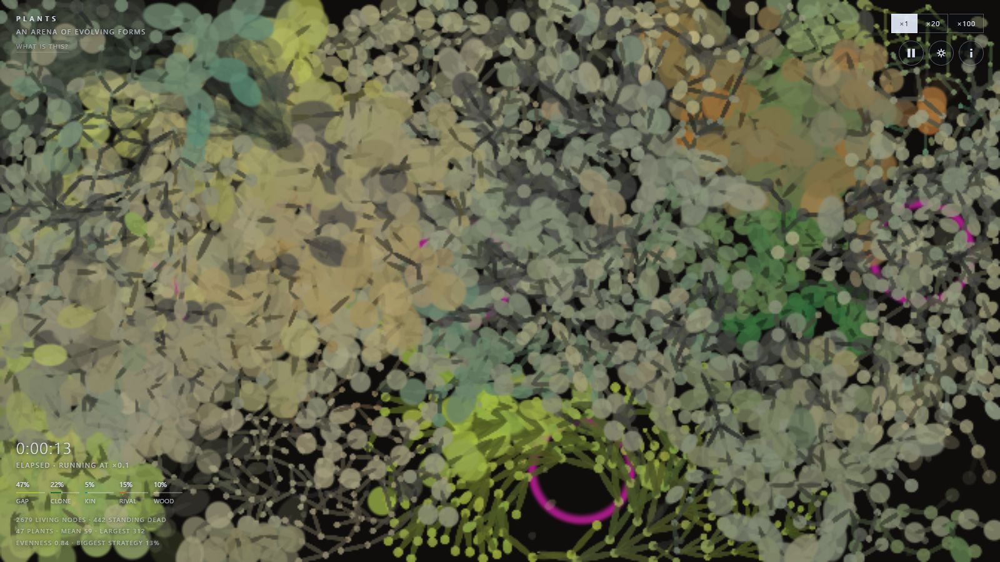
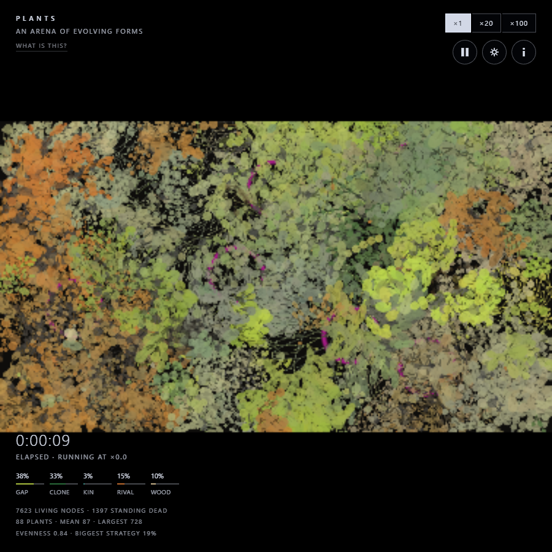

# Plants

Plants that evolve their own shape competing for a flat arena. There is no
terrain here and no weather — the only environment is each other, and it never
stops moving.

One self-contained `index.html` — hand-rolled WebGL2, no libraries, no build
step, **zero network requests**. Published to GitHub Pages at
https://donmarshworks.github.io/plants/



---

## What it is

A 16:9 arena of uniform ground. Plants grow into it a node at a time, branching
in continuous position, and every one of them carries a short program that
decides how it grows. They compete for room, they age, they die from the middle
outward, and the pieces that break off go on as plants in their own right.

Nothing about a spot is decided before the plants arrive. What makes one place
different from another is **what is already growing there** — and that turns out
to be enough, because it is the one kind of environment that cannot settle down.

There are five ways to make a living, and they are the five things a patch of
ground can be:

| niche | a living |
|---|---|
| **gap** | open ground — pioneers race into it and suffocate when it closes |
| **clone** | a plant's own tissue — dense mats, but a founder standing alone has almost none of it and must survive on very little until its second node arrives |
| **kin** | other plants running the same strategy — stands rather than solitaries |
| **rival** | contested borders, pressed up against strangers |
| **wood** | standing dead heartwood — living on what the others leave behind |

Those five make each other. Pioneers fill open ground, which makes crowding,
which is what a thicket-builder wants; a thicket ages into dead wood, which is
what the wood-dwellers want; the wood rots through and the gap is back. That is
succession, and it is written nowhere — it is what those five definitions do
when you leave them alone.

**Colour is information, not decoration.** Hue says which of the five a lineage
is built for; saturation says how committed it is, so generalists wash out
toward grey. The picture is therefore a map of what every patch is doing, and
the same colour appearing twice in similar places is convergent evolution rather
than a coincidence.

## Where it came from

This is the evolving-plants half of [Aetheris](https://github.com/DonMarshWorks/aetheris),
lifted off the planet it grew on. The ecology — the genome, the formulas, fit,
heartwood, fragmentation, spores, the census — came across nearly intact. What
did not come with it was everything that made a planet: terrain, climate,
seasons, the sun, a camera, a sphere. In their place the plants supply their own
environment.

Two things follow from that and shape the whole piece:

- **There is no camera.** The whole arena is on screen at all times, so a node
  is always the same size on the glass, and the trade between "many small
  competitors" and "a few individuals you can watch" has to be made once rather
  than deferred to a zoom. This takes the second side of it — this is an
  aesthetic project and the plants are the point.
- **The world has edges.** A rectangle does and a sphere does not. Growth is
  simply refused at the frame, so a plant pressed against it loses the turns it
  spends pushing. Nothing wraps around.

## Running it

Open `index.html`. That is all — it works from `file://`, a memory stick or an
aeroplane, because it fetches nothing.

```
npm run serve      # a local server on :8000, which is how it ships
npm run verify     # the gate: several minutes, renders in software
npm run verify -- --static     # the instant checks only
```

`npm i && npx playwright install chromium` once, first, for the harness. The
site itself has no dependencies.

## Experimenting

Every parameter is overridable from the URL, so a variant costs a minute and no
edit:

```
index.html#seed=7&step=0.05&minfrag=100&glen=48
```

Seed plus parameters determine a world completely — nothing reads the clock and
no genome draws from `Math.random` — so a link really is the world and not
merely a description of it. The settings panel writes one for you.

To search a space rather than look at one:

```
node tools/sweep.js envcap=1,2,3,4,5
node tools/sweep.js --seeds 8 --ticks 20000 reseed=0 minfrag=20,50,100
```

`sweep.js` refuses to average a dead world into a mean, checks that two runs of
one seed are byte-identical before it compares anything, and stops the frame
loop first. All three of those are scar tissue; see `CLAUDE.md`.

## The acceptance test

Two ways this genre of simulation dies: **monoculture**, where one strategy wins
and diversity goes to zero, and **extinction**. The piece passes if, on the
default settings across several seeds:

- niche evenness stays **above 0.45**
- no single strategy holds **more than half** the world
- all five niches stay occupied, and nothing goes extinct

Those two lines are drawn on the graphs, and `npm run verify` fails the build on
them. Everything else in the readout is description.

At the shipped defaults, across four seeds and 12,000 ticks: evenness 0.83–0.85,
biggest strategy 0.26–0.32, all five niches occupied, nothing extinct.

## The window never reshapes the world



Same arena, same plants, bars added. Verified at four window shapes.

## Documents

- [`docs/plants-design.md`](docs/plants-design.md) — the model as it stands, and why.
- [`docs/plants-measured.md`](docs/plants-measured.md) — the evidence. Every claim
  that was tested and what the testing said, **including the ones it destroyed**.
  Read this before trying an idea that sounds obvious.
- [`CLAUDE.md`](CLAUDE.md) — how to work on it, and the bugs that have already
  shipped once.

## License

MIT. See [LICENSE](LICENSE).
